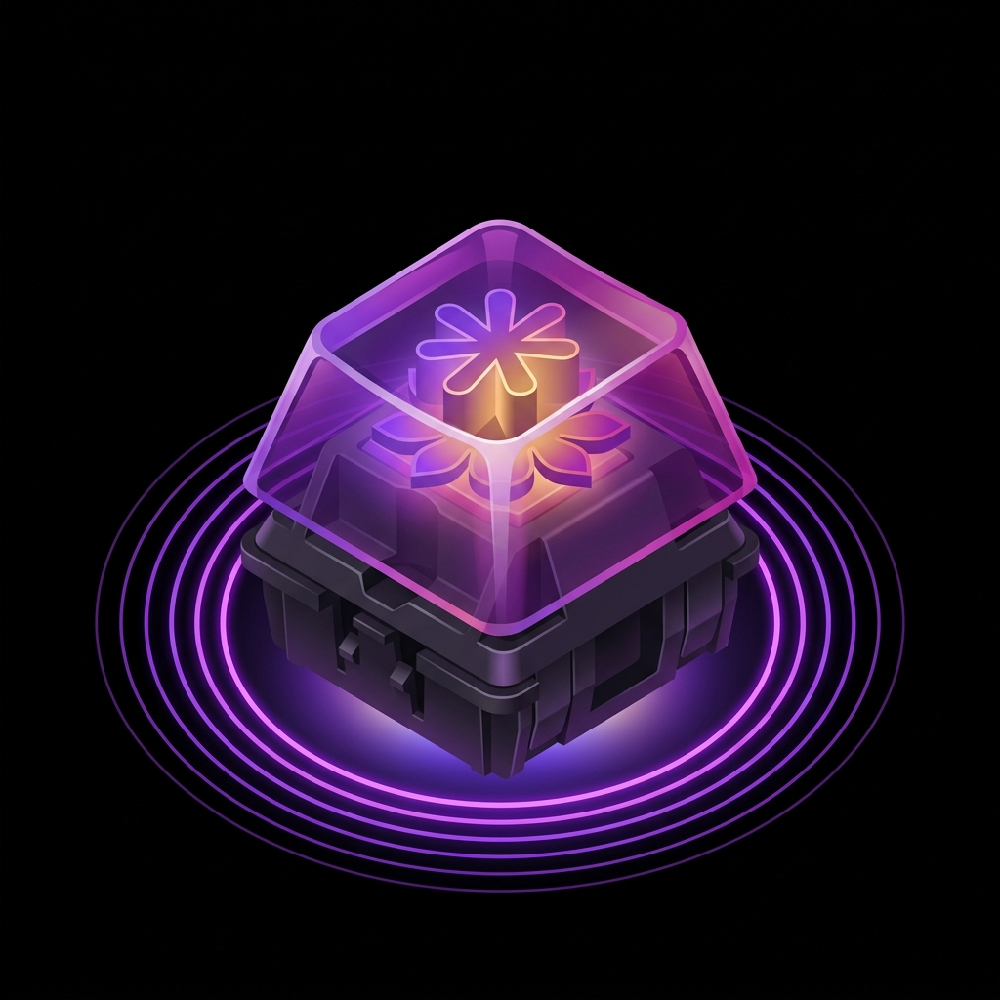

<div align="center">

# ⌨️ Thocky — Live Web Companion & Landing Showcase

**Zero-Latency Mechanical Keyboard Acoustic Simulator & Interactive Typing Playground**  
*Crafted by Maximus Labs • Built with Next.js 15, Tailwind CSS, and Web Audio API DSP Synthesis*

[](https://apps.microsoft.com/detail/9NV7HK5J91TQ)
[](https://nextjs.org/)
[](https://react.dev/)
[](https://tailwindcss.com/)
[](#license)

<br />



<br />
<br />

[**Explore Live Web Companion**](https://apps.microsoft.com/detail/9NV7HK5J91TQ) • [**Download Windows Desktop App**](https://apps.microsoft.com/detail/9NV7HK5J91TQ) • [**Report Issues**](https://github.com/)

</div>

---

## 🌟 Overview

**Thocky** is a precision acoustic soundboard and typing simulator designed to bring the deep, marbley, and tactile typing sensations of **$399+ custom enthusiast mechanical keyboards** to any Windows PC, Mac, or laptop — with **sub-millisecond latency** and zero recorded audio sample lag.

This repository contains the **official full-stack showcase web application and interactive acoustic simulator companion** for Thocky. Visitors can test custom switch profiles directly in their browser using procedural Web Audio synthesis, customize acoustic foam dampening layers, practice typing with live WPM/accuracy tracking, and install the native Windows app from the Microsoft Store.

---

## ✨ Key Features

### 🎧 1. Real-Time Procedural Web Audio Engine
- **Zero-lag synthesis**: Uses real-time oscillators, exponential decay gain envelopes, and multi-stage biquad resonance filters instead of heavy, repetitive MP3 clips.
- **Dynamic pitch modulation**: Subtle mathematical jitter on every keystroke simulates natural finger strike variance and artisan plate bounce.
- **True polyphonic mixing**: Up to 32 concurrent voice channels without clipping or voice stealing.

### 🎹 2. Curated Flagship Switch Matrix
Experience 6 handcrafted acoustic profiles:
- **Holy Panda X** — Rich, tactile pop with a snappy tactile bump peak at 2.1 kHz.
- **Gateron Oil King** — Deep, lubed linear thock with full polycarbonate housing dampening.
- **NovelKeys Cream** — Crisp, marbly acoustic bottom-out with high-frequency resonance.
- **Boba U4T** — Ultra-deep thock with prominent PBT keycap resonance.
- **Cherry MX Blue** — High-precision click-jacket snap with immediate feedback.
- **IBM Model M Buckling Spring** — Vintage metallic ping, steel plate resonance, and hollow chassis acoustics.

### 🛠️ 3. Dynamic Studio Acoustic Modifiers
- **Acoustic Volume & Space Decay**: Control overall master gain and room tail acoustics.
- **PE Foam & Tape Mod Simulation**: Toggle high-frequency dampening and bottom-out low-pass filtering.
- **Lube Intensity (Krytox 205g0 simulation)**: Smooth out mechanical scratch and sharpen the deep acoustic core.

### ⌨️ 4. Interactive Live Typing Playground
- Embedded typing speed & accuracy test with live WPM calculation.
- Full real-time keyboard visualizer with keystroke illumination.
- Instant switch-profile hotkey switching (<kbd>Ctrl</kbd> + <kbd>Shift</kbd> + <kbd>T</kbd>).

### 🪟 5. Seamless Microsoft Store Distribution
- Pre-configured deep links to the Windows MSIX packaging (`9NV7HK5J91TQ`).
- Integrated modal for 1-day free trial activation and annual pass license verification.

---

## 🚀 Tech Stack

| Layer | Technology |
| :--- | :--- |
| **Framework** | [Next.js 15 (App Router)](https://nextjs.org/) |
| **UI Library** | [React 19](https://react.dev/) |
| **Styling** | [Tailwind CSS v4](https://tailwindcss.com/) with custom Syne & JetBrains Mono typography |
| **Audio Engine** | Web Audio API (Procedural Bandpass Filters, Gain Envelopes, Polyphonic DSP) |
| **Icons & Visuals** | [Lucide React](https://lucide.dev/), Canvas Confetti, Custom 3D Artisan Keycap Assets |
| **Distribution** | [Microsoft Store (MSIX / Windows 10 & 11)](https://apps.microsoft.com/detail/9NV7HK5J91TQ) |

---

## 📦 Quick Start (Local Development)

### Prerequisites
- Node.js 18.18+ or Node.js 20+
- npm, yarn, or bun

### 1. Clone the Repository
```bash
git clone https://github.com/your-username/thocky-showcase.git
cd thocky-showcase
```

### 2. Install Dependencies
```bash
npm install
# or
bun install
```

### 3. Run Development Server
```bash
npm run dev
```

Open [http://localhost:3000](http://localhost:3000) with your browser to experience the live simulator.

### 4. Build for Production
```bash
npm run build
npm run start
```

---

## 🗂️ Project Structure

```text
├── app/
│   ├── globals.css           # Global Tailwind CSS and styling variables
│   ├── layout.tsx            # Root layout with metadata and OpenGraph tags
│   └── page.tsx              # Main showcase page assembling interactive modules
├── components/
│   ├── Navbar.tsx            # Sticky brand navigation with glassmorphism styling
│   ├── Hero.tsx              # Hero section with primary CTAs & live quick tester
│   ├── LiveAudioPlayground.tsx# Interactive typing suite with procedural audio synthesizer
│   ├── SwitchMatrixSection.tsx# 6-switch comparative frequency breakdown & sampler
│   ├── AcousticDnaSection.tsx# Visual breakdown of the DSP acoustic pipeline
│   ├── PricingDownloadSection.tsx# Microsoft Store trial & subscription overview
│   ├── DownloadModal.tsx     # Direct Microsoft Store launching modal
│   ├── FaqSection.tsx        # Expandable frequently asked questions
│   └── Footer.tsx            # Brand footer and documentation links
├── lib/
│   ├── audioEngine.ts        # Procedural Web Audio API sound synthesis engine
│   ├── storeConfig.ts        # Microsoft Store product IDs and URLs
│   └── utils.ts              # Class name merging utility
└── public/
    └── logo.png              # High-resolution artisan keycap logo
```

---

## 🛒 Windows Desktop Native App

Thocky is also packaged for Windows 10 and 11 as a native global background acoustic daemon:
- **Global Key Hooking**: Triggers acoustic audio in the background across all Windows apps, games, code editors, and browsers.
- **Zero-Latency Audio Pipeline**: Direct WASAPI low-latency output stream.
- **Hardware-friendly**: Consumes < 0.5% CPU overhead.
- **Store URL**: [https://apps.microsoft.com/detail/9NV7HK5J91TQ](https://apps.microsoft.com/detail/9NV7HK5J91TQ)

---

## 📄 License

Distributed under the MIT License. See `LICENSE` for more information.

---

<div align="center">
  <sub>Built with ❤️ by <strong>Maximus Labs</strong>. Elevating daily desktop craftsmanship.</sub>
</div>
